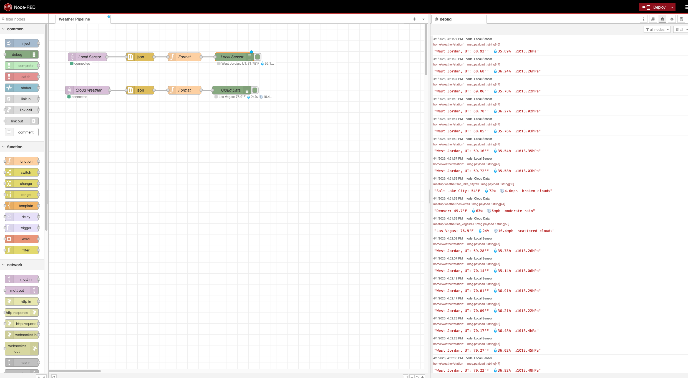

# MQTT + Python: Real-Time IoT Data Pipelines

A hands-on demo for the Python meetup. We'll go from "what is MQTT?" to a live multi-source weather dashboard in four progressive steps.



---

## What We're Building

```
[OpenWeatherMap API] ──► [MQTT Broker] ──► [Unified Dashboard]
[Local Weather Station] ──►      ▲
[KB2040 via USB Serial] ──►      │
[Meshtastic Mesh Radio] ──►      └── (any subscriber can tap in)
```

MQTT is a lightweight publish/subscribe protocol used everywhere in IoT — Home Assistant, AWS IoT Core, factory sensors, emergency mesh networks. The broker is the hub: publishers send data to *topics*, subscribers listen to topics. They never talk directly to each other.

---

## Setup

**Prerequisites:** Python 3.11+, [uv](https://docs.astral.sh/uv/getting-started/installation/)

```bash
# Clone and install dependencies
git clone <this-repo>
cd mqtt-demo
uv sync

# Copy the config template
cp .env.example .env
```

Edit `.env` and add your [OpenWeatherMap API key](https://openweathermap.org/api) (free tier, takes ~2 hrs to activate after signup):

```env
OPENWEATHER_API_KEY=your_key_here
MQTT_BROKER=localhost        # local broker for Demo 2–4
MQTT_PORT=1883
MQTT_TOPIC_PREFIX=meetup/weather
```

> **Inline override (no `.env` edit needed):**
> Prefix any command with env vars to override for that run only:
> ```bash
> MQTT_BROKER=test.mosquitto.org uv run demo2_cloud_weather.py
> ```

---

## Demo 1 — Hello, MQTT

**Concept:** Publish/subscribe basics on a public test broker.

Open two terminals:

```bash
# Terminal 1: start listening
uv run demo1_hello_mqtt.py --mode subscribe

# Terminal 2: send messages
uv run demo1_hello_mqtt.py --mode publish
```

Watch Terminal 1 receive the messages as they arrive. The publisher and subscriber don't know about each other — they only know about the broker and the topic name.

> Demo 1 always uses `test.mosquitto.org` regardless of `.env`.
> To point at a different broker: `MQTT_BROKER=broker.hivemq.com uv run demo1_hello_mqtt.py --mode publish`

**What to notice:**
- The subscriber starts before the publisher, yet receives all messages
- Topic: `meetup/weather/hello` — hierarchical, like a file path
- `test.mosquitto.org` is a public broker: no account, no auth, anyone can publish

---

## Demo 2 — Cloud Weather Bridge

**Concept:** The *bridge pattern* — translate a REST API into a live MQTT stream.

```bash
uv run demo2_cloud_weather.py
```

Polls OpenWeatherMap every 60 seconds for Salt Lake City, Denver, and Las Vegas, then publishes each reading to individual topics:

```
meetup/weather/salt_lake_city/temperature
meetup/weather/salt_lake_city/humidity
meetup/weather/denver/temperature
...
```

> **No API key yet?** Keys take ~2 hrs to activate after signup.
> To publish to the public broker instead (skip the API entirely for now):
> ```bash
> MQTT_BROKER=test.mosquitto.org uv run demo2_cloud_weather.py
> ```

**What to notice:**
- One publisher, many topics — subscribers can choose just the city or field they care about
- The REST API has no idea MQTT exists; the bridge script is the translator
- With `retain=True`, any subscriber that joins late still gets the last reading immediately

---

## Demo 3 — Self-Hosted Broker + Local Sensor

**Concept:** Run your own broker. Simulate a sensor. Build a live dashboard.

First, start a local Mosquitto broker:

```bash
# Podman
podman run -it -p 1883:1883 eclipse-mosquitto

# Docker
docker run -it -p 1883:1883 eclipse-mosquitto

# Homebrew
brew install mosquitto && mosquitto
```

Then open two more terminals:

```bash
# Terminal 1: simulated weather station (publisher)
uv run demo3_self_hosted/server.py

# Terminal 2: live dashboard (subscriber)
uv run demo3_self_hosted/subscriber.py
```

The server publishes realistic temperature/humidity data with natural-looking variation (sine wave + noise). The subscriber renders a live-updating terminal dashboard.

> Both scripts hardcode `localhost:1883`. To point at a remote broker:
> ```bash
> # edit BROKER at the top of server.py, or set it in the script directly for the demo
> ```

**What to notice:**
- The subscriber uses the wildcard topic `home/weather/#` — catches everything under that prefix
- You own the broker: no data leaves your machine
- The dashboard updates in-place using `rich` — no web server, no browser

---

## Demo 4 — Full Pipeline

**Concept:** Multiple publishers, one broker, one dashboard — this is the MQTT payoff.

Make sure the local broker is running (from Demo 3), then open three terminals:

```bash
# Terminal 1: local simulated sensor
uv run demo3_self_hosted/server.py

# Terminal 2: cloud weather bridge (publishes to localhost per .env)
uv run demo2_cloud_weather.py

# Terminal 3: unified dashboard
uv run demo4_pipeline.py
```

The dashboard shows cloud data and local sensor data side-by-side, all sourced from the same local broker.

> All three use `MQTT_BROKER=localhost` from `.env`.
> To show cloud data coming from the public broker instead:
> ```bash
> MQTT_BROKER=test.mosquitto.org uv run demo2_cloud_weather.py
> # then update demo4_pipeline.py TOPICS to point meetup/# at test.mosquitto.org
> ```

**What to notice:**
- The two publishers don't know about each other or the dashboard
- Adding a new data source means writing one new publisher — nothing else changes
- This is how production IoT systems work: sensors, APIs, and dashboards are fully decoupled

---

## Node-RED — Visual Flow Editor

**Concept:** See every message move through the pipeline in a visual editor. Node-RED is a flow-based tool where you wire MQTT topics to logic and outputs by drawing connections.

The flows are pre-wired in `node-red/flows.json` — no manual setup at the browser.

First, make sure the local broker is running, then:

```bash
# Create a shared network so Node-RED can reach the broker by name
podman network create mqtt-net
podman network connect mqtt-net mqtt-demo-broker

# Start Node-RED with the pre-built flows
podman run -d --name node-red \
  --network mqtt-net \
  -p 1880:1880 \
  --user root \
  -v $(pwd)/node-red:/data \
  nodered/node-red
```

Open **http://localhost:1880** — you'll see two parallel pipelines already connected:

```
[MQTT In: home/weather/#]      → [JSON] → [Format] → [Debug: Local Sensor]
[MQTT In: meetup/weather/+/all] → [JSON] → [Format] → [Debug: Cloud Data  ]
```

Start the sensor and cloud bridge, then watch the debug panel on the right side fill up in real time:

```bash
uv run demo3_self_hosted/server.py   # local sensor
uv run demo2_cloud_weather.py        # cloud bridge
```

> To point at a different broker: edit the `Local Mosquitto` config node in the Node-RED UI (double-click any MQTT node → Edit broker).

**What to notice:**
- The flows are just data — you can export, import, version-control, and share them (that's what `flows.json` is)
- You can add a new step (filter, transform, alert) by dropping in a node and drawing a wire — no code needed
- The same broker powering your Python scripts is powering Node-RED simultaneously

---

## Demo 5 — KB2040 Hardware Sensor Bridge

**Concept:** A real microcontroller as an MQTT edge device — no WiFi chip needed. The KB2040 runs CircuitPython and streams JSON over USB serial; a host-side bridge publishes it to the broker.

**Hardware required:** [Adafruit KB2040](https://www.adafruit.com/product/5302)

### Board boot states

The KB2040 has two completely different USB modes. Knowing which one you're in is the key to everything:

| Drive mounts as | How to get there | What goes here |
|-----------------|------------------|----------------|
| `RPI-RP2` | Double-tap RESET | CircuitPython `.uf2` firmware file |
| `CIRCUITPY` | Single RESET tap (after firmware is flashed) | `code.py`, `lib/` folder |

`code.py` and libraries will be silently ignored if copied to `RPI-RP2` — that drive only processes `.uf2` files.

### One-time board setup

**Step 1 — Flash CircuitPython** (only needed once):

```bash
# Double-tap the RESET button → RPI-RP2 mounts
make flash-kb2040
# Downloads CircuitPython 9.2.1 UF2 and copies it to the board.
# Board reboots automatically → CIRCUITPY mounts.
```

**Step 2 — Install libraries and copy firmware:**

```bash
# CIRCUITPY is now mounted (single RESET tap if needed)
make libs-kb2040    # circup installs neopixel into lib/
make copy-kb2040    # copies kb2040/code.py to the board
```

The NeoPixel will blink green once per second when running correctly.

### Running the demo

Make sure the local broker is running (from Demo 3), then:

```bash
# Terminal 1: serial → MQTT bridge (auto-detects the board by USB VID/PID)
uv run demo5_kb2040.py

# Terminal 2: watch the topic
mosquitto_sub -h localhost -t "home/sensors/#" -v
```

Each JSON line from the device becomes a retained message on `home/sensors/kb2040`.

### Development workflow

```bash
# Edit kb2040/code.py, then:
make copy-kb2040        # copy once

# Or watch for saves and auto-copy (requires: brew install fswatch):
make watch-kb2040
```

CircuitPython reloads `code.py` automatically whenever the file changes on the drive — no manual restart needed.

**What to notice:**
- CircuitPython is a full Python runtime in ~256 KB — it runs real `.py` files, no compilation step
- The serial bridge pattern works for *any* microcontroller without WiFi (Arduino, RP2040, etc.)
- The broker doesn't know or care whether the publisher is a cloud API or a $10 dev board over USB
- Plug in the board → data flows; unplug it → bridge exits cleanly. Zero broker config changes

> **Optional — connect an analog sensor to A0** (potentiometer, photocell, soil moisture probe, etc.). The `voltage_v` field in the payload will reflect whatever is wired there.

---

## Bonus — Meshtastic Mesh Radio

**Hardware required:** Meshtastic LoRa device + BME280 sensor (I2C)

```bash
uv run bonus_meshtastic.py --port /dev/ttyUSB0
```

Receives environment telemetry (temperature, humidity, pressure) from mesh network nodes over LoRa radio and publishes it to MQTT — same pipeline, new data source.

**Real-world use case:** Off-grid sensor networks, emergency communications, remote monitoring with no cell coverage.

---

## Core MQTT Concepts

| Concept | What it means |
|---------|---------------|
| **Broker** | Central hub — routes messages between publishers and subscribers |
| **Topic** | Address string, hierarchical: `home/floor1/bedroom/temp` |
| **`+` wildcard** | One level: `home/+/bedroom/temp` matches any floor |
| **`#` wildcard** | All remaining levels: `home/#` matches everything under home |
| **QoS 0** | Fire-and-forget — fastest, no delivery guarantee |
| **QoS 1** | At-least-once — retried until acknowledged |
| **QoS 2** | Exactly-once — slowest, guaranteed no duplicates |
| **Retain** | Broker stores the last message; new subscribers get it immediately |

---

## Why MQTT Instead of HTTP?

- **Push vs. pull:** Subscribers receive data instantly; no polling loop required
- **Always-on connection:** ~2x smaller packet overhead than HTTP
- **Fan-out built in:** One publish reaches thousands of subscribers simultaneously
- **Decoupled:** Publishers and subscribers are independent — add or remove either without changing the other

---

## Project Structure

```
mqtt-demo/
├── demo1_hello_mqtt.py        # Basic pub/sub (~88 lines)
├── demo2_cloud_weather.py     # Cloud API → MQTT bridge (~162 lines)
├── demo3_self_hosted/
│   ├── server.py              # Simulated weather station (~79 lines)
│   └── subscriber.py          # Live terminal dashboard (~93 lines)
├── demo4_pipeline.py          # Unified multi-source dashboard (~133 lines)
├── demo5_kb2040.py            # KB2040 serial → MQTT bridge (~100 lines)
├── kb2040/
│   └── code.py                # CircuitPython firmware (flash to the board)
├── bonus_meshtastic.py        # Meshtastic mesh → MQTT (~159 lines)
├── mqtt_weather_meetup.md     # Full theory, discussion prompts, references
├── pyproject.toml             # Dependencies (managed by uv)
└── .env.example               # Config template
```
